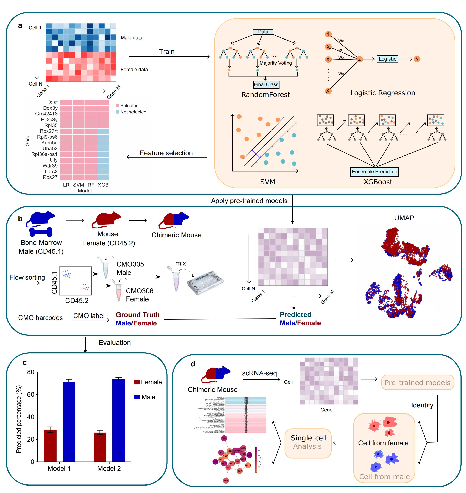

# CellSexID: Single-Cell Sex Identification Tool

[](https://www.python.org/downloads/)
[](https://opensource.org/licenses/MIT)
[](https://www.biorxiv.org/content/10.1101/2024.12.02.626449v2)


*Figure 1: Overview of the CellSexID workflow and validation approach.*

## Publication

**CellSexID: A Tool for Predicting Sex from Single-Cell RNA-Seq Data**  
[Read the paper on bioRxiv](https://www.biorxiv.org/content/10.1101/2024.12.02.626449v2)

---

CellSexID predicts biological sex from single-cell RNA-seq data using machine learning approaches with automatic feature selection capabilities.

## Main Application Scenarios

- **Sample demultiplexing**: Identify sex for mixed-sex samples without prior knowledge
- **Quality control**: Verify reported sex labels in published datasets  
- **Organ transplantation studies**: Track donor vs recipient cells by sex
- **Cross-tissue analysis**: Apply models trained on one tissue to predict sex in another
- **Species translation**: Adapt human-trained models for mouse studies

## Core Functionalities

- Machine learning models (Logistic Regression, SVM, XGBoost, Random Forest)
- Automatic gene discovery with cross-validation feature selection
- Predefined sex marker genes for human and mouse
- Cross-dataset validation and batch effect handling
- Command-line interface and Python API

## Installation

### Option 1: Package Installation (Recommended)
```bash
# Install from GitHub
pip install git+https://github.com/mcgilldinglab/CellSexID.git

# Or clone and install locally
git clone https://github.com/mcgilldinglab/CellSexID.git
cd CellSexID
pip install .
```

### Option 2: Development Installation
```bash
# Clone repository
git clone https://github.com/mcgilldinglab/CellSexID.git
cd CellSexID

# Create clean environment
conda create -n cellsexid python=3.9
conda activate cellsexid

# Install dependencies and package
pip install -e .
```

### Option 3: Manual Installation (Development)
```bash
git clone https://github.com/mcgilldinglab/CellSexID.git
cd CellSexID
pip install -r requirements.txt
```
### Using the included datasets:

Training data: Extract preprocessed_training_data.h5ad.zip - ready to use immediately

Test datasets: Extract data.zip for additional validation datasets
## Quick Start

### Command Line Interface
```bash
# Mouse data with predefined markers
cellsexid --species mouse --train train.h5ad --test test.h5ad --output predictions.csv

# Human data with predefined markers
cellsexid --species human --train train.h5ad --test test.h5ad --output predictions.csv

# Custom marker discovery
cellsexid --species mouse --marker_train discovery.h5ad train.h5ad --test test.h5ad --output predictions.csv
```

### Python API
```python
from cellsexid import SexPredictionTool

# Initialize and train
tool = SexPredictionTool(species='mouse', use_predefined_genes=True)
tool.fit(train_data='train.h5ad')

# Make predictions
predictions, cell_names = tool.predict(test_data='test.h5ad')
tool.save_predictions(predictions, cell_names, 'predictions.csv')
```

## Command Line Usage

### View All Options
```bash
cellsexid --help
```

### Workflow Examples

#### Workflow 1: Simple 2-Dataset (Predefined Markers)
```bash
# Mouse with predefined markers
cellsexid --species mouse --train train.h5ad --test test.h5ad --output results.csv

# Human with predefined markers  
cellsexid --species human --train train.h5ad --test test.h5ad --output results.csv

# Custom genes
cellsexid --species mouse --train train.h5ad --test test.h5ad --output results.csv \
  --custom_genes "Xist,Ddx3y,Kdm5d,Eif2s3y"
```

#### Workflow 2: Advanced 3-Dataset (Custom Marker Discovery)
```bash
# Discover markers + train + test (3 separate files)
cellsexid --species human --marker_train marker.h5ad train.h5ad --test test.h5ad --output results.csv

# Same data for marker discovery and training (most common)
cellsexid --species mouse --marker_train train.h5ad train.h5ad --test test.h5ad --output results.csv
```

#### Additional Options
```bash
# Choose different model
cellsexid --species mouse --train train.h5ad --test test.h5ad --output results.csv --model XGB

# Custom sex column name
cellsexid --species human --train train.h5ad --test test.h5ad --output results.csv --sex_column gender

# Generate distribution plot
cellsexid --species mouse --train train.h5ad --test test.h5ad --output results.csv --plot distribution.png

# Feature selection parameters for marker discovery
cellsexid --species mouse --marker_train train.h5ad train.h5ad --test test.h5ad --output results.csv \
  --top_k 15 --min_models 2

# Verbose output
cellsexid --species mouse --train train.h5ad --test test.h5ad --output results.csv --verbose
```

## Data Requirements

CellSexID accepts `.h5ad` files (AnnData format) with:

```python
adata.X              # Expression matrix (cells × genes)
adata.obs["sex"]     # Sex labels: "Male"/"Female" or "M"/"F" or 0/1
adata.var_names      # Gene symbols
```

Data should be preprocessed (filtered, normalized, log-transformed). See tutorials for preprocessing examples.

## Tutorials

### Tutorial 1: Basic Sex Prediction (`CellSexID_tutorial.ipynb`)
Demonstrates sex prediction for mouse and human single-cell datasets, covering data preprocessing, model training with multiple algorithms, and cross-validation evaluation.

### Tutorial 2: Cross-Tissue Analysis - Human (`CellSexID_Human_cross_tissue.ipynb`) 
Cross-tissue validation by training models on one tissue type and testing on another, addressing tissue-specific expression variations.

### Tutorial 3: Cross-Tissue Analysis - Mouse (`CellSexID_Mouse_cross_tissue.ipynb`)
Cross-tissue sex prediction using mouse single-cell data, demonstrating model transfer capabilities across different tissue types.

## API Reference

See [API.md](API.md) for detailed documentation of classes, methods, and parameters.

## Output Files

### Predictions
```csv
cell_id,predicted_sex
CELL001,Female
CELL002,Male
CELL003,Female
```

### Feature Selection Results (when using custom marker discovery)
```
feature_selection_results/
├── LogisticRegression_feature_importances.csv
├── SVC_feature_importances.csv  
├── XGBClassifier_feature_importances.csv
├── RandomForestClassifier_feature_importances.csv
└── selected_genes_majority_vote.csv
```

## Citation

```bibtex
@article{tai2024cellsexid,
  title={CellSexID: A Tool for Predicting Sex from Single-Cell RNA-Seq Data},
  author={Tai, Huilin and Li, Qian and Wang, Jingtao and Tan, Jiahui and Lang, Ryann and Petrof, Basil J and Ding, Jun},
  journal={bioRxiv},
  year={2024},
  publisher={Cold Spring Harbor Laboratory}
}
```

## License

MIT License - see [LICENSE](LICENSE) file for details.

## Support

- **Issues**: [GitHub Issues](https://github.com/mcgilldinglab/CellSexID/issues)
- **Contact**: huilin.tai@mail.mcgill.ca
