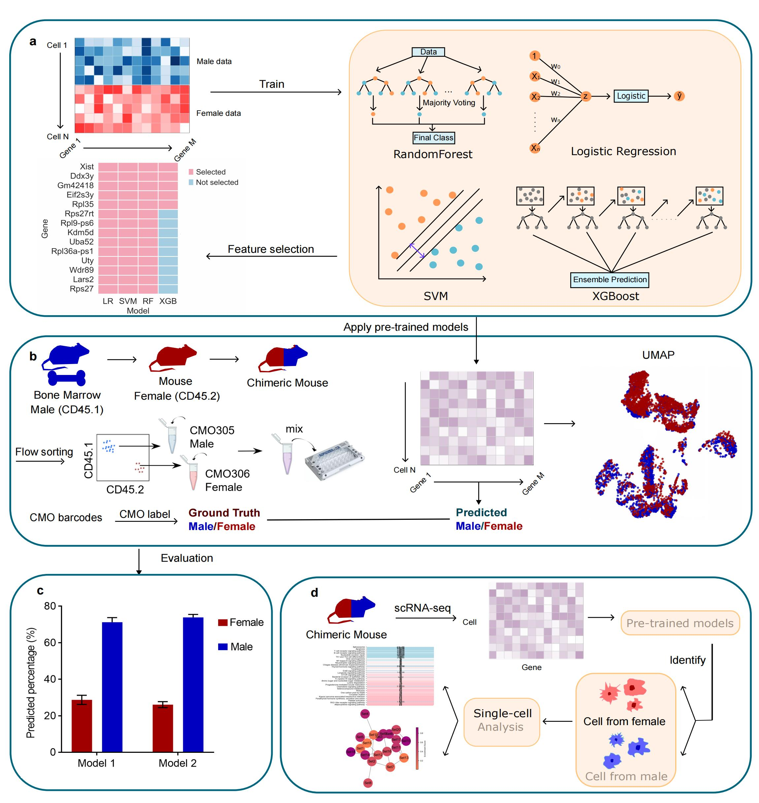

---

# CellSexID

CellSexID is a streamlined and user-friendly tool designed to predict the biological sex of cells based on single-cell RNA-seq data. It leverages machine learning models trained on publicly available datasets to make accurate predictions on user-provided single-cell input data.


<div align="center" style="margin-left: -20%;">
  
  <p><em>Figure 1: Overview of the CellSexID workflow.</em></p>
</div>
*Figure 1: Overview of the CellSexID workflow.*

- **a.** Identification of sex-specific gene features for predicting cell origin in single-cell RNA sequencing data. A committee of four classifiers (Random Forest, Logistic Regression, SVM, XGBoost) selects genes deemed critical for distinguishing cell sex, based on majority voting across models.
- **b.** Experimental validation of CellSexID using chimeric mouse models. The single-cell RNA-seq data from chimeric mice are used to test classifiers pre-trained on a public dataset, with predictions based on the selected gene features. Diaphragm macrophages from female mice transplanted with male bone marrow are isolated, flow-sorted, barcoded, and sequenced, serving as ground truth for validating CellSexID predictions.
- **c.** Evaluation of the model's predictive performance using various metrics calculated against flow cytometry-derived ground truth, providing an assessment of reliability.
- **d.** Application of CellSexID for annotating cell origin in chimeric mice enables a range of single-cell analyses, supporting studies of cellular dynamics and differences between recipient and donor cells in diverse research contexts.

---

## Key Features

- **Simplified Workflow:** Trains on public datasets to ensure accessibility and reproducibility.
- **Single-Cell Focus:** Tailored for single-cell RNA-seq data input in H5AD format.
- **Accurate Predictions:** Utilizes advanced machine learning models (XGBoost, Logistic Regression, SVM, Random Forest).
- **Visualization:** Provides options to visualize the distribution of predicted sexes.
- **Command-Line Interface:** Easy-to-use CLI for seamless integration into pipelines.
- **Detailed Tutorial:** Our notebook serves as a comprehensive tutorial covering all steps, including model training and prediction.

---

## Getting Started

### Prerequisites

Before using CellSexID, ensure you have the following:

- **Python 3.8+**
- **Anaconda or Miniconda** (recommended for managing environments)
- **Dependencies** (install via `requirements.txt`):
  - `scanpy`
  - `anndata`
  - `pandas`
  - `numpy`
  - `scikit-learn`
  - `xgboost`
  - `matplotlib`
  - `seaborn`
- **Additional Installation via Pip:**
  - Install the package directly from GitHub:
    ```bash
    pip install git+https://github.com/mcgilldinglab/CellSexID.git
    ```

### Installation

1. **Clone the repository:**

   ```bash
   git clone https://github.com/mcgilldinglab/CellSexID.git
   cd CellSexID
   ```

2. **Create a virtual environment (optional but recommended):**

   ```bash
   conda create -n cellsexid_env python=3.8
   conda activate cellsexid_env
   ```

3. **Install dependencies:**

   ```bash
   pip install -r requirements.txt
   ```

4. **Install CellSexID package:**

   ```bash
   pip install .
   ```

   Or install directly from GitHub:

   ```bash
   pip install git+https://github.com/mcgilldinglab/CellSexID.git
   ```

---

## Usage

Our Jupyter notebook provides a comprehensive tutorial covering all steps, including model training and prediction. It includes detailed explanations and code examples to help you understand and use CellSexID effectively.

### Running Predictions via Command Line

CellSexID provides a command-line interface to train models and predict the biological sex of cells in your dataset.

#### Command-Line Arguments

- `--train_data`: Path to the preprocessed training data in H5AD format.
- `--test_data`: Path to the test data in H5AD format.
- `--model`: (Optional) Machine learning model to use (`XGB`, `LR`, `SVM`, `RF`). Default is `XGB`.
- `--output`: Path to the output CSV file where predictions will be saved.
- `--plot`: (Optional) Path to save the distribution plot of predicted sexes.

#### Running Predictions

1. **Prepare Your Data:**

   - **Training Data (`preprocessed_data.h5ad`):**
     - We provide a preprocessed training data file, `preprocessed_data.zip`, which contains `preprocessed_data.h5ad`.
     - **Download and Extract Training Data:**
       - The zipped training data file is included in the repository.
       - Unzip the file:
         ```bash
         unzip preprocessed_data.zip
         ```
       - This will extract `preprocessed_data.h5ad`, which you can use for training.

     - **Contents of Training Data:**
       - Includes gene expression data with genes as variables and cells as observations.
       - Contains a `gender` column in `adata.obs` with binary labels:
         - `0` for Female
         - `1` for Male

   - **Test Data (`.h5ad`):**
     - Gene expression data of the cells you want to predict.
     - Should be in H5AD format with genes as variables and cells as observations.

2. **Run the Prediction Script:**

   ```bash
   cellsexid-run \
       --train_data preprocessed_data.h5ad \
       --test_data <path_to_test_data.h5ad> \
       --model XGB \
       --output predictions.csv \
       --plot distribution.pdf
   ```

   **Example:**

   ```bash
   cellsexid-run \
       --train_data preprocessed_data.h5ad \
       --test_data sex_chimeric_gender_9_25.h5ad \
       --model XGB \
       --output predictions.csv \
       --plot distribution.pdf
   ```

3. **Output Files:**

   - **Predictions CSV (`predictions.csv`):** Contains `cell_id` and `predicted_sex` columns.
   - **Distribution Plot (`distribution.pdf`):** Bar plot showing the percentage of cells predicted as Male or Female.

---

## API Documentation

CellSexID provides the following key functions:

### `SexPredictionTool`

A class that encapsulates the functionality for training and predicting cell sex.

#### Methods:

- `process_training_data(h5ad_path)`

  - **Description:** Reads preprocessed training data from an H5AD file.
  - **Parameters:**
    - `h5ad_path` (str): Path to the training data H5AD file.
  - **Returns:**
    - `X` (numpy.ndarray): Feature matrix.
    - `y` (numpy.ndarray): Labels array.

- `process_test_data(h5ad_path)`

  - **Description:** Processes test data from an H5AD file.
  - **Parameters:**
    - `h5ad_path` (str): Path to the test data H5AD file.
  - **Returns:**
    - `X_test` (numpy.ndarray): Test feature matrix.
    - `cell_names` (list): List of cell identifiers.

- `train(X_train, y_train, model_name='XGB')`

  - **Description:** Trains the selected model.
  - **Parameters:**
    - `X_train` (numpy.ndarray): Training feature matrix.
    - `y_train` (numpy.ndarray): Training labels array.
    - `model_name` (str): Model to use (`XGB`, `LR`, `SVM`, `RF`).

- `predict(X_test, model_name='XGB')`

  - **Description:** Makes predictions using the trained model.
  - **Parameters:**
    - `X_test` (numpy.ndarray): Test feature matrix.
    - `model_name` (str): Model to use.

- `save_predictions(y_pred, cell_names, output_file)`

  - **Description:** Saves predictions to a CSV file.
  - **Parameters:**
    - `y_pred` (numpy.ndarray): Predicted labels.
    - `cell_names` (list): List of cell identifiers.
    - `output_file` (str): Path to the output CSV file.

- `plot_prediction_distribution(y_pred, save_path=None)`

  - **Description:** Plots the distribution of predicted sexes.
  - **Parameters:**
    - `y_pred` (numpy.ndarray): Predicted labels.
    - `save_path` (str, optional): Path to save the plot.

---

## Installation as a Package

You can install CellSexID as a package using pip:

```bash
pip install git+https://github.com/mcgilldinglab/CellSexID.git
```

This allows you to import `SexPredictionTool` in your own scripts:

```python
from cellsexid import SexPredictionTool

# Initialize the tool
sex_predictor = SexPredictionTool()

# Use the tool as per your requirements
```

---

## Input and Output

### Input Data Format

- **H5AD Files:** Both training and test data should be in AnnData's `.h5ad` format.
- **Gene Expression Matrix:**
  - Genes as variables (`adata.var_names`).
  - Cells as observations (`adata.obs_names`).
- **Training Data Requirements:**
  - Must include a `gender` column in `adata.obs` with binary labels:
    - `0` for Female
    - `1` for Male
  - **Provided Training Data:**
    - The repository includes a zipped training data file, `preprocessed_data.zip`.
    - **Instructions to Access:**
      - Unzip the file:
        ```bash
        unzip preprocessed_data.zip
        ```
      - This will extract `preprocessed_data.h5ad`, which you can use for training.
- **Selected Genes:**
  - The tool uses a predefined list of genes:
    - `'Rpl35'`, `'Rps27rt'`, `'Rpl9-ps6'`, `'Rps27'`, `'Uba52'`, `'Lars2'`, `'Gm42418'`, `'Uty'`, `'Kdm5d'`, `'Eif2s3y'`, `'Ddx3y'`, `'Xist'`
  - Ensure these genes are present in your datasets.

### Output Data

- **Predictions CSV:**
  - Columns:
    - `cell_id`: Cell identifiers from the test data.
    - `predicted_sex`: Predicted sex (`Male` or `Female`).
- **Distribution Plot:**
  - Bar plot visualizing the percentage distribution of predicted sexes.

---

## Example Workflow

1. **Prepare Training Data (`preprocessed_data.h5ad`):**

   - **Access the Training Data:**
     - The training data is provided in the repository as `preprocessed_data.zip`.
     - Unzip the file:
       ```bash
       unzip preprocessed_data.zip
       ```
     - This will extract `preprocessed_data.h5ad`.

   - **Contents of Training Data:**
     - Contains gene expression data and a `gender` column with binary labels (`0` for Female, `1` for Male).

2. **Prepare Test Data (`sex_chimeric_gender_9_25.h5ad`):**

   - Contains gene expression data of cells to predict.
   - Ensure that the selected genes are present in this dataset.

3. **Run the Prediction Script:**

   ```bash
   cellsexid-run \
       --train_data preprocessed_data.h5ad \
       --test_data sex_chimeric_gender_9_25.h5ad \
       --model XGB \
       --output predictions.csv \
       --plot distribution.pdf
   ```

4. **Review Outputs:**

   - **`predictions.csv`:** Check the predicted sexes.
   - **`distribution.pdf`:** Visualize the sex distribution.

---

## Publication

Our research article detailing CellSexID is now available on bioRxiv:

[CellSexID: A Tool for Predicting Biological Sex from Single-Cell RNA-Seq Data](https://doi.org/10.1101/xxxxxxxxxxx)
 

---

## Contributing

Contributions are welcome! If you have suggestions or would like to report issues, please submit them through the [Issues](https://github.com/mcgilldinglab/CellSexID/issues) section of the repository.

---

## License

This project is licensed under the [MIT License](LICENSE).

---

## Acknowledgments

- Inspired by robust methodologies developed for biological sex prediction.
- Thanks to the contributors and public datasets that make this tool possible.

---

## Contact

For questions or support, please contact **Huilin Tai** at [2378174791@qq.com](mailto:2378174791@qq.com).

---

## References

- [Scanpy Documentation](https://scanpy.readthedocs.io/en/stable/)
- [Anndata Documentation](https://anndata.readthedocs.io/en/latest/)
- [XGBoost Documentation](https://xgboost.readthedocs.io/en/latest/)

---

**Note:** Ensure that you have the necessary permissions and licenses for any datasets used during training and prediction.

---

# Quick Links

- [API Documentation](#api-documentation)
- [Installation Guide](#getting-started)
- [Usage Instructions](#usage)
- [Example Workflow](#example-workflow)
- [Publication on bioRxiv](#publication)

---

By following this guide, you can set up and use CellSexID for your single-cell RNA-seq data analysis, leveraging its powerful prediction capabilities and integrating it into your research pipeline.

---

**Disclaimer:** While the installation and basic functionality should work, the package may contain bugs. Please report any issues on the GitHub repository so we can address them promptly.

---

**Happy Analyzing!**

---
